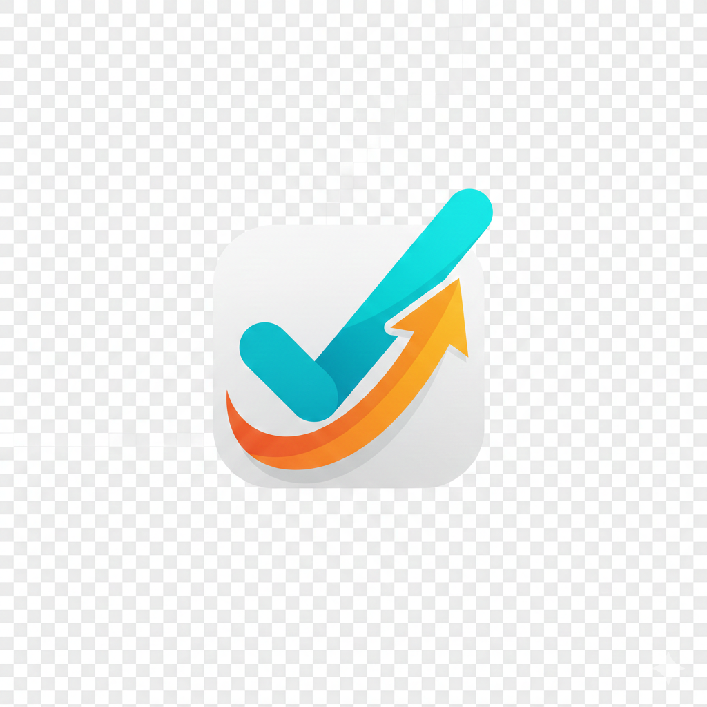

# Todolist App

A modern, powerful, and minimalist task management application featuring a Kanban board, analytics dashboard, and seamless user experience. Built with React, TypeScript, and a Go backend.



## 🌟 Features

- **Kanban Board**: Visualize your workflow with a drag-and-drop Kanban board. Organized by columns: Backlog, Todo, In Progress, and Done.
- **Project Dashboard**: Get insights into your productivity with an analytics dashboard featuring charts and statistics using Recharts.
- **User Authentication**: Secure Login and Registration pages with JWT authentication.
- **Modern UI**: Built with a "premium" aesthetic using TailwindCSS and Shadcn/UI components.
- **Dark Mode**: Fully supported dark mode for comfortable viewing in any environment.
- **Responsive Design**: Optimized for desktops and tablets.
- **Activity Logs**: Track changes and updates in the application (if implemented).

## 🛠️ Tech Stack

### Frontend

- **Framework**: [React](https://react.dev/) with [Vite](https://vitejs.dev/)
- **Language**: [TypeScript](https://www.typescriptlang.org/)
- **Styling**: [TailwindCSS](https://tailwindcss.com/)
- **Components**: [Shadcn/UI](https://ui.shadcn.com/) (Radix UI based)
- **State Management & Data Fetching**: [TanStack Query (React Query)](https://tanstack.com/query/latest)
- **Routing**: [React Router DOM](https://reactrouter.com/en/main)
- **Drag & Drop**: [dnd-kit](https://dndkit.com/)
- **Charts**: [Recharts](https://recharts.org/en-US/)
- **Icons**: [Lucide React](https://lucide.dev/)

### Backend

- **Language**: [Go (Golang)](https://go.dev/)
- **Database**: PostgreSQL (implied based on `pg` or typical Go stacks, check your specific configuration)

## 🚀 Getting Started

Follow these instructions to get the project up and running on your local machine.

### Prerequisites

- [Node.js](https://nodejs.org/) (v16 or higher)
- [Go](https://go.dev/) (v1.20 or higher)
- [PostgreSQL](https://www.postgresql.org/) (or your configured database)

### Installation

1.  **Clone the repository**

    ```bash
    git clone https://github.com/yourusername/todolist-app.git
    cd todolist-app
    ```

2.  **Frontend Setup**
    Navigate to the frontend directory:

    ```bash
    cd frontend
    ```

    Install dependencies:

    ```bash
    npm install
    ```

    Start the development server:

    ```bash
    npm run dev
    ```

3.  **Backend Setup**
    Navigate to the backend directory (assuming standard structure):

    ```bash
    cd ../backend
    ```

    Install Go dependencies:

    ```bash
    go mod download
    ```

    Run the backend server:

    ```bash
    go run cmd/main.go
    # or just
    go run main.go
    ```

4.  **Environment Variables**
    Make sure to configure your `.env` files for both frontend (if needed) and backend (database connection strings, JWT secrets, etc.).

## 📸 Screenshots

_(Add your screenshots here. You can put them in an `assets` folder or the `public` folder and link them like below)_

|                  Login Page                  |          Kanban Board          |
| :------------------------------------------: | :----------------------------: |
|  | _Your Kanban Board Screenshot_ |

## 🤝 Contributing

Contributions are welcome! Please feel free to submit a Pull Request.

1.  Fork the project
2.  Create your Feature Branch (`git checkout -b feature/AmazingFeature`)
3.  Commit your Changes (`git commit -m 'Add some AmazingFeature'`)
4.  Push to the Branch (`git push origin feature/AmazingFeature`)
5.  Open a Pull Request

## 📄 License

This project is licensed under the MIT License - see the [LICENSE](LICENSE) file for details.
